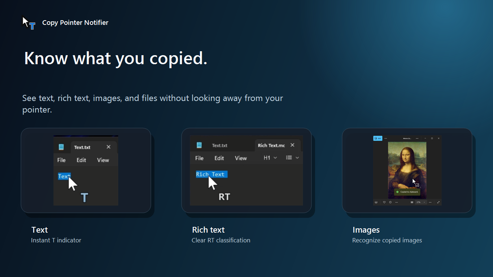
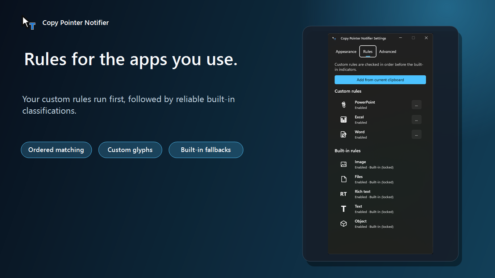
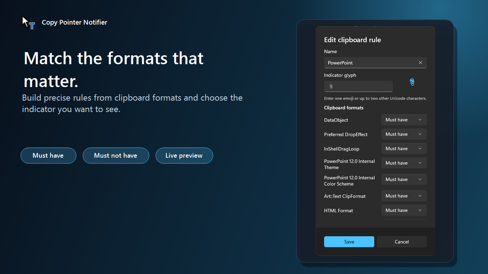
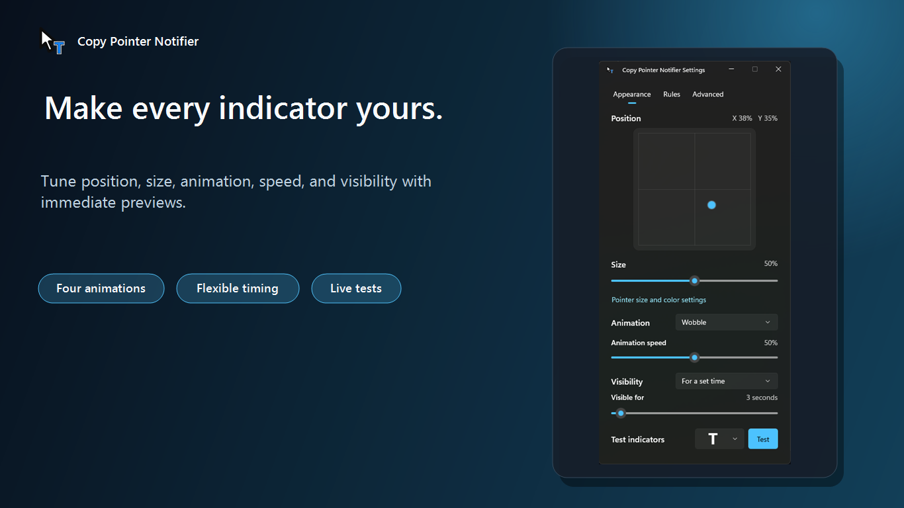
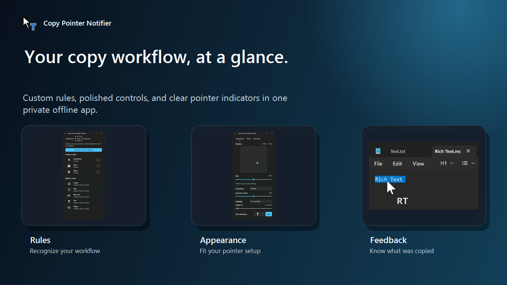

<p align="center">
  
</p>

<h1 align="center">Copy Pointer Notifier</h1>

<p align="center">
  <strong>Know what you copied without looking away from your pointer.</strong><br>
  A lightweight, private Windows tray app that displays the copied content type beside your mouse pointer.
</p>

<p align="center">
  <a href="https://apps.microsoft.com/detail/9P1Q0CGM9L1G">
    
  </a>
</p>

The indicator follows the active cursor, respects accessibility pointer sizing and coloring, and remains visible after its animation in a smaller state. Copy Pointer Notifier works entirely on your device: it reads clipboard format types, never clipboard contents, and includes no accounts, telemetry, advertising, or network services.

## Get the app

[Download Copy Pointer Notifier from the Microsoft Store](https://apps.microsoft.com/detail/9P1Q0CGM9L1G).

Official prebuilt releases are currently available exclusively through the Microsoft Store. This repository contains the source code and build instructions, but does not distribute standalone binaries or GitHub Releases at this time.

## Screenshots

| Copy indicators | Clipboard rules |
| :---: | :---: |
|  |  |
| **Rule editor** | **Appearance** |
|  |  |

<p align="center">
  
</p>

## Features

- Reacts to every Windows clipboard update.
- Tracks the pointer through a low-level mouse hook instead of visible polling lag.
- Hides with the system cursor and when the indicator would leave the active monitor.
- Excludes the indicator overlay from screenshots and screen capture, matching the hardware cursor.
- Scales its size and offset relative to the configured Windows pointer size.
- Animates from the Windows accent color to the active pointer color.
- Samples the rendered accessibility cursor to support white, black, custom-colored, and enlarged pointers.
- Uses an adaptive black or white outline so indicators remain visible over light and dark content.
- Provides a system-themed WinUI 3 settings window with Mica and native title-bar controls.
- Supports startup registration, JSON backup and restore, and live indicator previews.
- Supports ordered clipboard-format rules with custom one- or two-character glyphs.
- Can keep the latest indicator visible or hide it automatically after 1-60 seconds.
- Uses WinUI string resources so additional interface languages can be added with `.resw` files.
- Offers four animation styles: Fade & shrink, Camera shutter, Pulse, and Wobble.

## Clipboard types

User rules are evaluated first in their configured order. A custom rule matches
when every **must have** format is present and every **must not have** format is
absent. Rules can use standard Windows clipboard formats or named registered
formats, and can be edited, reordered, disabled, or deleted.

The following locked rules are always evaluated afterward:

| Content | Indicator |
| --- | --- |
| Bitmap or image | Image indicator |
| Copied files | File indicator |
| Rich text or HTML | `RT` |
| Plain text | `T` |
| Anything else | Object indicator |

## Usage

1. Start `CopyPointerNotifier.exe`.
2. Copy content with **Ctrl+C** or another application command.
3. Click the notification-area icon to open **Settings**, or right-click it to enable or disable the indicator, configure startup, open **Settings**, or exit.

The settings window is divided into Appearance, Rules, and Advanced pages. It
provides:

- A two-dimensional pointer-relative position editor.
- A normalized 0-100 indicator-size slider, defaulting to 50%.
- A link to Windows pointer size and color settings.
- A selectable animation style applied immediately to copy notifications and previews.
- A 0-100 animation-speed control, with 50 preserving the standard timing.
- A visibility mode that keeps the indicator until the next copy or hides it after 1-60 seconds.
- A Test menu that previews every built-in indicator through the real overlay.
- A rule editor that captures the current clipboard's persistable formats as
  initial required conditions.
- Drag-and-drop ordering, live custom-glyph tests, and a separate locked
  built-in rule list with the same indicator artwork used by the overlay.
- Reset, versioned JSON backup, and restore actions.

The default pointer-relative position is **X 30 / Y 50**. Size 50 preserves the previous 55% visual size; values above 50 expand progressively so 100 retains the former maximum.

## Architecture

The application uses two small processes so the always-running component stays native and minimal:

| Component | Technology | Responsibility |
| --- | --- | --- |
| `CopyPointerNotifier.exe` | C++20 / Win32 / GDI+ | Tray icon, clipboard listener, mouse hook, cursor sampling, animation, and layered overlay |
| `CopyPointerNotifier.Settings.exe` | C++/WinRT / WinUI 3 | On-demand settings UI, registry persistence, system settings link, and JSON backup/restore |

The settings process launches only when requested and communicates with the native process through app-specific window messages. Preferences are stored under:

```text
HKCU\Software\MrWyss\CopyPointerNotifier
```

Custom rules are stored with stable standard-format IDs and registered-format
names so they continue to work after Windows assigns new runtime IDs. Backups
use a versioned JSON document containing app, indicator, and custom-rule
settings. Version 1 backups remain supported and restore with no custom rules.

### Localization

The Settings interface and native tray menu use Windows resource files instead of embedding user-facing text in behavior code. English strings are in `settings\Strings\en-US\Resources.resw` and `resources.rc`; another language can be added with a matching `settings\Strings\<language-tag>\Resources.resw` resource set and translated native resources.

## Build

### Requirements

- Windows 10 version 2004 or later, or Windows 11
- CMake 3.20 or later
- Visual Studio 2026 Build Tools with **Desktop development with C++**
- Windows App SDK 1.8 runtime (installed via framework package or Windows App SDK installer)
- Windows SDK 10.0.26100.0

### Visual Studio

For x64:

```powershell
cmake -S . -B build -A x64
cmake --build build --config Release
ctest --test-dir build -C Release --output-on-failure
```

For Windows on ARM64, use Visual Studio's ARM64 C++ build tools:

```powershell
cmake -S . -B build-arm64 -A ARM64
cmake --build build-arm64 --config Release
```

The CMake build detects the target platform automatically. The native Settings app uses MSBuild with Windows App SDK NuGet packages.
Run the ARM64 tests on an ARM64 Windows device; cross-compiled ARM64 test executables cannot run on an x64 build machine.

### MinGW

MinGW can build the native tray application only. The WinUI 3 settings app requires MSVC:

```powershell
cmake -S . -B build -G "MinGW Makefiles"
cmake --build build --parallel
ctest --test-dir build --output-on-failure
```

The native executable is written to `build\Release\CopyPointerNotifier.exe` with Visual Studio or `build\CopyPointerNotifier.exe` with MinGW. The native WinUI settings application is built separately via MSBuild and output to a `settings\` subfolder beside the native executable (for example `build\Release\settings\`), matching the packaged layout so the tray app resolves it with a single relative path. Both x64 and ARM64 are supported; ARM32 is not.

## Project layout

```text
src\                 Native tray application and overlay
settings\            WinUI 3 settings application
tests\               Clipboard classification tests
assets\              App icon source artwork and Windows ICO
docs\images\         Documentation, preview, and Store media
CMakeLists.txt        Native and settings build orchestration
```

## Current limitation

The Windows inverted pointer style is detected through cursor rendering, but exact background-dependent inversion fidelity is still pending.
